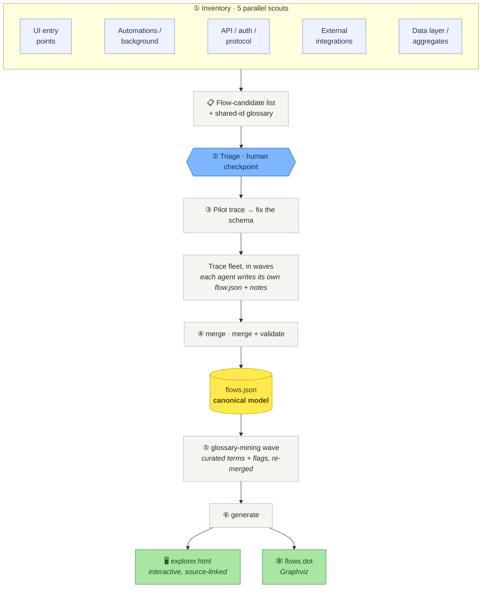

# event-storming-recovery

**Recover a strategic [Event Storming](https://www.eventstorming.com/) model from an existing
codebase, and render it as a navigable, source-linked flow explorer.**

Point it at a system that has only its *tactical* implementation (services, repositories,
controllers, no domain model written down) and it recovers the *strategic* view: for every flow
through the system, the actors, commands, aggregates, events, policies, read models and external
systems it moves through, from entry point to data write. Every sticky links to the source that
implements it, so you can step through a flow left to right and click into the code behind it.

## Try it

Needs Node **>= 22.12** and a browser. No clone, no plugin, no account.

```sh
npx event-storming-recovery view
```

That serves a bundled model — this tool's own recovered self-model — and opens it. Read the URL
from the printed banner: it prefers `127.0.0.1:5178` and falls forward to the next free port if
that one is taken.


Flows on the left, badged by kind and status. The flow itself in the centre as a sticky lane, with
invariants hanging off the aggregates that enforce them. Click any sticky for its tactical
explanation and a `vscode://` deep link to `file:line`. Red cards are **hotspots**: the questions a
human needs to answer.

## The method

Recovery is an **AI orchestration, not a CLI command.** There is no `recover` subcommand. A live
Claude session fans parallel agents out across your codebase, and they write the model between them:



`flows.json` is the single source of truth; the explorer and the DOT graph are generated from it.
Shared node ids unify recurring concepts across flows (one `agg-order`, referenced by every flow
that touches it), so the flows join into one navigable map instead of thirty islands. Reachability
checks during tracing catch dead and superseded flows, which is often where the most interesting
recovered intent lives.

Phases ④ and ⑥ are the plain CLI (`merge`, `generate`) and need only Node, so once agents have
written traces you can rebuild the model and its views without an AI in the loop. The reasoning
behind each phase is in [the method](docs/explanation/METHOD.md).

## Running it on your own codebase

Two prerequisites beyond the above: **Claude Code (the `claude` CLI) on your PATH**, and a real
token budget — the cost is the fan-out of agents reading your code, and it scales with the size of
the codebase and how many flows you trace at full depth.

The easy path is the plugin:

```
/plugin marketplace add bhastings-t3/event-storming-recovery
/plugin install event-storming-recovery@event-storming-recovery
```

Then tell Claude:

> **use the event storming explorer**

If the repo has no model yet, the skill offers to build one first, then launches the app. Because
the plugin declares the app's MCP server, your Claude session can read what you click: select a node
and say *"explain the selected aggregate"* or *"add these two invariants and open a PR"*, and Claude
works on the real files.

To drive the method by hand instead, no clone required — the npm package ships the playbook:

```sh
npm i -g event-storming-recovery
# then work through $(npm root -g)/event-storming-recovery/prompts/00-orchestrator.md
```

Prerequisites and cost stated up front in
[run the recovery on your own codebase](docs/how-to/run-recovery-on-your-codebase.md).

## Limits (read before trusting it)

A code-derived model is an **always-true scaffold and a conversation starter, not a replacement for
a workshop wall.** It faithfully captures nodes, edges, invariants and source anchors. It does *not*
capture true timeline order (horizontal position is reachability, not chronology), pivotal events,
bounded-context boundaries (those must be *declared* by the team, not inferred from folders),
swimlanes, or the human hotspots a live session surfaces. The tracing agents can be wrong: every
finding names its source so you can check it, and hotspots are framed as questions, not verdicts.

Use it to get oriented fast, and to drive the conversations that need a human.

## Docs

[Getting Started](docs/tutorials/getting-started.md) walks the whole shape of the tool in a few
minutes, against the bundled model, with no codebase of your own required. The
[full documentation set](docs/README.md) covers the [CLI](docs/reference/cli.md), the
[MCP bridge](docs/reference/mcp.md), the [model schema](docs/reference/flows-schema.md), and
[how the app fits together](docs/explanation/architecture.md).

## License

MIT: see [LICENSE](LICENSE).
