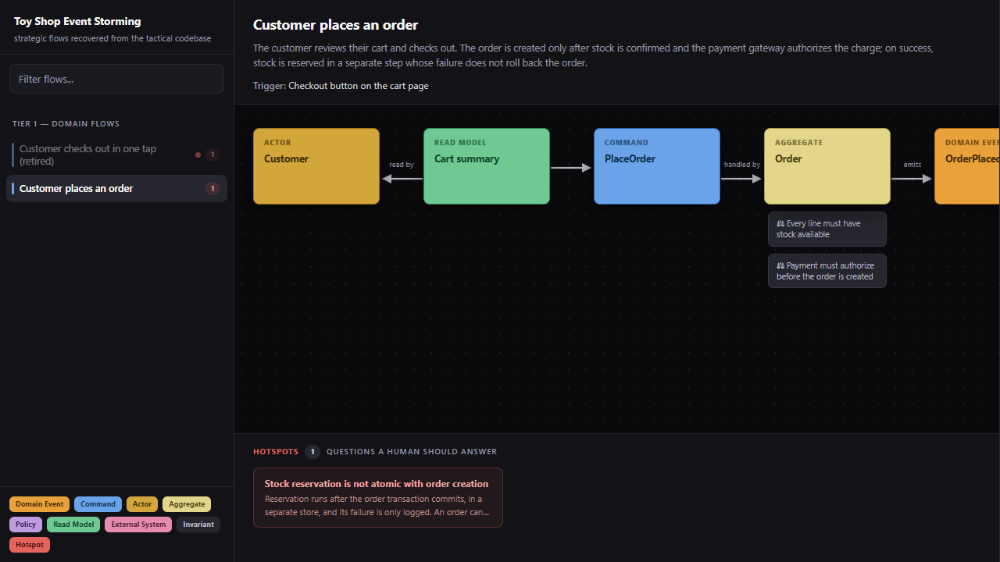
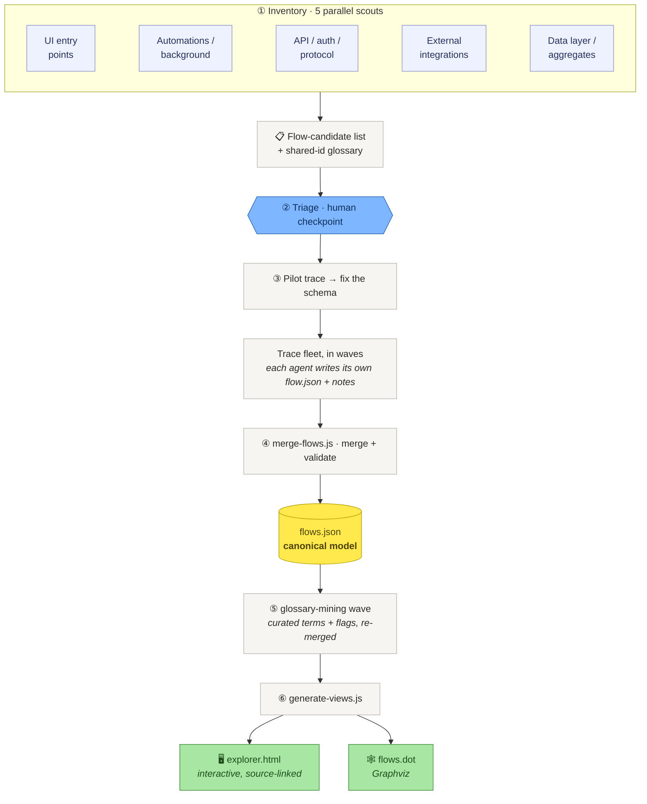

# event-storming-recovery

**Recover a strategic [Event Storming](https://www.eventstorming.com/) model from an existing
codebase, and render it as a navigable, source-linked flow explorer.**

Point this at a system that only has its *tactical* implementation (services, repositories,
controllers — no domain model written down) and it recovers the *strategic* view: for every flow
through the system — a user action, a scheduled job, an inbound API call — the actors, commands,
aggregates, events, policies, read models, and external systems it moves through, from entry point
to data write. Each sticky links to the exact source that implements it, so you can step through
any flow left-to-right and click into the code behind it.

It's a repeatable, orchestrated process: parallel **scout** agents inventory every entry point,
one **deep-trace** agent per flow reads the code end-to-end, and the results merge into a validated
`flows.json` that renders to an interactive `explorer.html` and a Graphviz `flows.dot`.

## Install & quick start

Install the plugin — it bundles both skills, the tools, and the explorer's MCP server declaration:

```
/plugin marketplace add bhastings-t3/event-storming-recovery
/plugin install event-storming-recovery@event-storming-recovery
```
(or from a shell: `claude plugin marketplace add bhastings-t3/event-storming-recovery` then
`claude plugin install event-storming-recovery@event-storming-recovery`.)

Then just tell Claude:

> **use the event storming explorer**

The `event-storming-explorer` skill takes it from there: if the repo has no recovered model yet, it
**offers to build one first** (the recovery workflow); then it launches the interactive app
(`npx event-storming-recovery view` on port 5178) and — because the plugin declares the app's MCP
server — your Claude session can read what you click. Select a node and say *"explain the selected
aggregate"* or *"add these two invariants and open a PR"*, and Claude works on the real files, to a PR.

> **Heads-up:** the viewer runs via `npx event-storming-recovery view`, which needs the
> `event-storming-recovery` npm package published (tracked in the repo issues). Until then it works
> for local development via `npm link`.

The rest of this README explains each half in detail: **[the interactive app + Claude
integration](#explore-it-interactively--and-work-with-claude)**, and **[the recovery workflow that
builds the model](#run-it-on-your-own-codebase)**.

## See the output in 30 seconds

```sh
node tools/merge-flows.js examples/toy-shop/traces examples/toy-shop/model/flows.json
node tools/generate-views.js examples/toy-shop/model/flows.json examples/toy-shop/model --title "Toy Shop Event Storming"
# then open examples/toy-shop/model/explorer.html in a browser
```



Left: the flows, badged by kind (read/write/policy) and status (dead/superseded), with hotspot
counts. Center: the flow as an Event-Storming sticky lane, invariants hanging off aggregates, edge
verbs between stickies. Click any sticky for its tactical explanation and a `vscode://` deep link to
`file:line`. Red cards are **hotspots** — the questions a human needs to answer.

## Explore it interactively — and work with Claude

Instead of the static `explorer.html`, run the interactive app straight from npm:

```sh
npx event-storming-recovery view            # in any repo; auto-discovers model/flows.json
npx event-storming-recovery view --model path/to/flows.json --repo-root .
```

It starts a small local server (one port) that serves a SPA (Flows board, Gallery, Glossary,
Overview, source-linked detail panel) and a JSON + MCP API. Click a sticky to inspect it; **view
source** pulls the real code behind an anchor inline; **right-click → Add to context bundle** gathers
nodes; the **Context** pill (top-right) opens a drawer to review, clear, and **Copy for Claude**.

The app is a **context authority any Claude session can read** — it doesn't own Claude. Connect your
own `claude` terminal to the running app once:

```sh
claude mcp add --transport http event-storming http://127.0.0.1:5178/mcp
# or commit a .mcp.json to the repo (see .mcp.json.example)
```

Then, with the app running, in that Claude session:

- Click a node in the app, then say *"explain the selected node"* → Claude calls `get_current_selection`
  and gets the node grounded in its invariants, flows, and real source anchors.
- *"the selected aggregate needs these two invariants — implement it and open a PR"* → Claude works in
  **your** session, on the real files, with your git/PR flow.
- `@event-storming:event-storming://selected-nodes` hands Claude the whole curated bundle at once
  (e.g. several fractured aggregates you want consolidated).

MCP tools: `get_current_selection`, `get_node`, `get_flow`, `list_model`. Resource:
`event-storming://selected-nodes`.

**With the plugin installed you don't run any of this by hand** — just tell Claude *"use the event
storming explorer"* and the `event-storming-explorer` skill launches the app, connects the MCP
server (which the plugin declares), and, if no model exists yet, offers to build one first via the
recovery workflow.

## Run it on your own codebase

This is an **agent-orchestrated** process (a coding agent — e.g. Claude Code — drives it; the
deterministic parts are the schema, the merge/validate, and the render). Two ways to start:

- **As a Claude Code plugin** (recommended) — install it, then either say *"use the event storming
  explorer"* (the **`event-storming-explorer`** skill launches the app + MCP bridge, building a model
  first if none exists) or invoke the **`event-storming-recovery`** skill directly to drive all six
  recovery phases:

  ```
  /plugin marketplace add bhastings-t3/event-storming-recovery
  /plugin install event-storming-recovery@event-storming-recovery
  ```
  (or from a shell: `claude plugin marketplace add bhastings-t3/event-storming-recovery` then
  `claude plugin install event-storming-recovery@event-storming-recovery`). The repo is both the
  marketplace and the plugin; both skills, the MCP server declaration, and the bundled prompts/tools
  install together. The explorer's viewer comes from the `event-storming-recovery` npm package via
  `npx` (publish it — see the repo issues — so installed users get it with no extra setup).

- **By hand / any agent:** follow `prompts/00-orchestrator.md`. It tells the orchestrator how to
  spawn the scouts (`prompts/01-scouts.md`), triage with you (`prompts/02-triage.md`), brief the
  trace agents (`prompts/03-trace-briefing.md`), mine the ubiquitous language
  (`prompts/04-glossary-mining.md`), then merge and render. Every one of those sub-agents inherits
  the recursion protocol (`prompts/recursive-exploration.md`): when an agent hits a high-signal
  pathway it spawns its own sub-agents to chase it, so the exploration adapts its depth to the
  code instead of running as a flat fan-out.

Then the deterministic pipeline:

```sh
node tools/merge-flows.js  <tracesDir> <out>/model/flows.json          # merge many trace slices + validate
node tools/generate-views.js <out>/model/flows.json <out>/model \      # emit flows.dot + explorer.html
    --repo-root "/abs/path/to/your/checkout" --title "<Project> Event Storming"
```

## How it works



- **`flows.json`** is the single source of truth; the explorer and DOT are generated from it.
- **Shared node ids** unify recurring concepts across flows (one `agg-order` node, referenced by
  every flow that touches it), so the flows join into one navigable map instead of 30 islands.
- **Reachability checks** during tracing catch **dead and superseded** flows — often where the most
  interesting recovered intent lives (why was this replaced? what does the successor do differently?).
- **A curated ubiquitous language** (Phase 5) mines the domain vocabulary and jargon into
  `flows.json`'s top-level `terms` and renders it in the explorer's **Glossary** tab. Terms the
  mining can't fully resolve are **flagged** with the question a human should answer — same contract
  as hotspots — so the glossary marks its own gaps instead of hiding them.

See [`METHOD.md`](docs/METHOD.md) for the full methodology and the reasoning behind each phase.

## Repo layout

| path | what |
|---|---|
| `bin/`, `src/` | the `es-view` app: the local server (`src/server/`, incl. the MCP endpoint), the React SPA explorer (`src/web/`), and shared libs (`src/lib/`). Launched by `npx event-storming-recovery view` |
| `tools/` | the tooling: `merge-flows.js` (merge + validate) and `generate-views.js` (render DOT + static explorer) |
| `prompts/` | the method, encoded: orchestrator playbook + scout / triage / trace-briefing / glossary-mining templates + the shared recursive-exploration protocol |
| `docs/` | `METHOD.md` (the methodology and its reasoning) and `flows-schema.md` (the node/edge/flow contract) |
| `scripts/` | helper scripts (`build-example.mjs` rebuilds the demo, `dev.mjs` runs the app in dev) |
| `tests/` | smoke tests (`node --test`) covering merge, generate, and the validator |
| `examples/toy-shop/` | a tiny synthetic model so the pipeline runs out of the box |
| `skills/event-storming-recovery/` | the **recovery** skill — orchestrates building the model |
| `skills/event-storming-explorer/` | the **explorer** skill — launches the app + MCP bridge and drives working with Claude on the model |
| `.claude-plugin/` | marketplace + plugin manifests (incl. the `event-storming` MCP server declaration) that make this repo installable as a plugin |
| `.github/workflows/ci.yml` | runs the tests + example build on every push |

## Limits (read before trusting it)

A code-derived model is an **always-true scaffold and a conversation starter — not a replacement
for a workshop wall.** It faithfully captures nodes, edges, invariants, and source anchors, but it
does *not* capture: true timeline order (horizontal position is reachability, not chronology),
pivotal events, bounded-context boundaries (those must be *declared* by the team, not inferred from
folders), swimlanes, or the human hotspots a live session surfaces. The tracing agents can be wrong;
every finding names its source so you can check it, and the hotspots are framed as questions, not
verdicts. Use it to get oriented fast and to drive the conversations that need a human.

## Iterating

Everything is regenerable from the per-flow `traces/*.json`. To extend a map, add a new trace
(follow `docs/flows-schema.md`, reuse the shared node ids so it joins the existing flows) and
re-run the two commands. To improve the *method*, edit the prompts in `prompts/` and the schema —
the pilot-trace-then-fix loop in phase 3 is designed to surface schema gaps cheaply.

## License

MIT — see [LICENSE](LICENSE).
