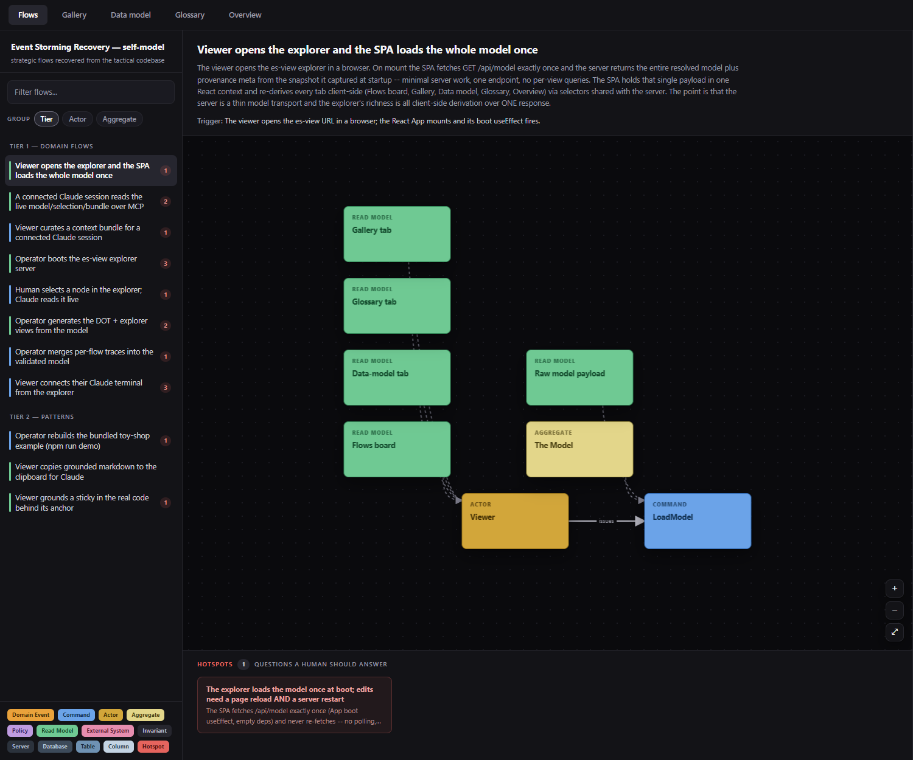
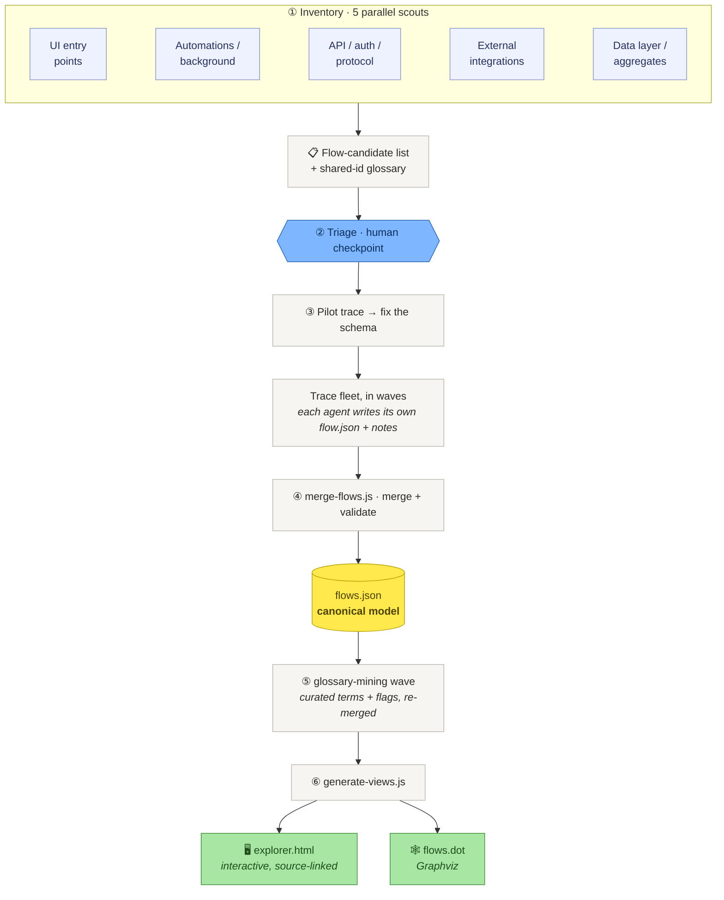

# event-storming-recovery

**Recover a strategic [Event Storming](https://www.eventstorming.com/) model from an existing
codebase, and render it as a navigable, source-linked flow explorer.**

Point this at a system that only has its *tactical* implementation (services, repositories,
controllers: no domain model written down) and it recovers the *strategic* view: for every flow
through the system, a user action, a scheduled job, an inbound API call, the actors, commands,
aggregates, events, policies, read models, and external systems it moves through, from entry point
to data write. Each sticky links to the exact source that implements it, so you can step through
any flow left to right and click into the code behind it.

It's a repeatable, orchestrated process: parallel **scout** agents inventory every entry point,
one **deep-trace** agent per flow reads the code end-to-end, and the results merge into a validated
`flows.json` that renders to an interactive `explorer.html` and a Graphviz `flows.dot`.

New here? The [Getting Started tutorial](docs/tutorials/getting-started.md) walks the whole shape
of the tool in a few minutes, with no target codebase of your own required. Everything else in
this README is a fast orientation; the [documentation set](docs/README.md) is where each topic
gets its full treatment.

## Run it right now (zero setup)

**Prerequisite:** Node **>= 22.12** and a web browser. Nothing else: no clone, no plugin, no
account.

The package is published to npm, so one command boots the explorer against a bundled model (this
tool's own recovered self-model):

```sh
npx event-storming-recovery view --no-open
```

It prints a banner with the URL it bound to (usually `http://127.0.0.1:5178`, but it **falls
forward** to the next free port if that one is taken, so read the printed URL rather than assuming
5178). Open that URL and you have the full interactive board: click a flow, step through its sticky
lane, and follow a `vscode://` link into the source. With no `--model`/`--traces` argument, `view`
auto-discovers a `**/model/flows.json` under the current directory and falls back to the bundled
self-model when there isn't one, so it always has something to show.

That is the whole of the *runnable* tool. The CLI ships three subcommands (`view`, `merge`,
`generate`; see the [CLI reference](docs/reference/cli.md)), and they work standalone with just
Node.

## Recovering a model is an AI orchestration, not a CLI command

Producing a model *for a new codebase* is a different thing from viewing one. **There is no
`recover` command**: `event-storming-recovery --help` shows only `view`/`merge`/`generate`. The
model-producing phases are driven by a live, interactive Claude session that spawns several
concurrent sub-agents (five parallel scouts, then per-flow trace agents in waves of ~5-7) against
`prompts/00-orchestrator.md`. So recovery has extra prerequisites: **Claude Code (the `claude` CLI)
installed and on your PATH**, an interactive session to drive it, and a real (non-trivial) token
budget for the fan-out of agents reading your codebase. Start with
[how to run the recovery on your own codebase](docs/how-to/run-recovery-on-your-codebase.md), which
states the prerequisites and cost up front. The `merge`/`generate` CLI then turns the traces those
agents write into the model you `view`.

## The plugin path

Prefer to drive this from inside Claude Code rather than by hand? Install the plugin: it bundles
both skills, the tools, and the explorer's MCP server declaration:

```
/plugin marketplace add bhastings-t3/event-storming-recovery
/plugin install event-storming-recovery@event-storming-recovery
```
(or from a shell: `claude plugin marketplace add bhastings-t3/event-storming-recovery` then
`claude plugin install event-storming-recovery@event-storming-recovery`.)

Then just tell Claude:

> **use the event storming explorer**

The `event-storming-explorer` skill takes it from there: if the repo has no recovered model yet, it
**offers to build one first** (the recovery workflow), then it launches the interactive app
(`npx event-storming-recovery view`). Because the plugin declares the app's MCP server, your Claude
session can read what you click. Select a node and say *"explain the selected aggregate"* or *"add
these two invariants and open a PR"*, and Claude works on the real files, to a PR.

For the full walkthrough, see [Getting Started](docs/tutorials/getting-started.md). For running
the recovery on your own codebase or connecting your own Claude terminal, see the
[how-to guides](docs/README.md#how-to-guides-get-a-specific-job-done).

## See the output in 30 seconds

The bundled example is **this tool's own recovered self-model**: the workflow run against this
very repository (a code-derived Event Storming model of the CLI, the es-view server, and the MCP
bridge).

```sh
npx event-storming-recovery view   # zero setup: serves the bundled example, opens your browser
```

From a clone you can instead rebuild it from its committed traces and open the static file:

```sh
npm run demo   # rebuilds examples/event-storming-recovery/model from its traces
# then open examples/event-storming-recovery/model/explorer.html in a browser
```



Left: the flows, badged by kind (read/write/policy) and status (dead/superseded), with hotspot
counts. Center: the flow as an Event-Storming sticky lane, invariants hanging off aggregates, edge
verbs between stickies. Click any sticky for its tactical explanation and a `vscode://` deep link
to `file:line`. Those links carry the generating machine's absolute checkout path; if you open a
board someone else generated, click **Source root** in the tab bar once to point them at your own
local checkout (it is remembered in your browser). Red cards are **hotspots**: the questions a human needs to answer. The **Data
model** tab shows the storage the code touches (here, the filesystem model dir and `flows.json`'s
shape, since there's no database) cross-linked to the read models and aggregates that read and
write it.

## How it works



`flows.json` is the single source of truth; the explorer and DOT are generated from it. Shared node
ids unify recurring concepts across flows (one `agg-order` node, referenced by every flow that
touches it), so the flows join into one navigable map instead of 30 islands. Reachability checks
during tracing catch dead and superseded flows, often where the most interesting recovered intent
lives. See [the method](docs/explanation/METHOD.md) for the reasoning behind each phase, and
[how the app fits together](docs/explanation/architecture.md) for why the running tool is built
this way.

## Working with it

- **Run the recovery on your own codebase**, either via the `event-storming-recovery` skill or by
  hand with `prompts/00-orchestrator.md`: see
  [how to run the recovery on your own codebase](docs/how-to/run-recovery-on-your-codebase.md).
  The npm package ships `prompts/`, `skills/`, `docs/`, and `examples/`, so you can drive the
  method by hand without a clone: after `npm i -g event-storming-recovery`, the playbook is at
  `$(npm root -g)/event-storming-recovery/prompts/00-orchestrator.md`.
- **Connect your own Claude terminal** to a running explorer so it can read your live selection and
  curated context bundle: see
  [how to connect a Claude terminal](docs/how-to/connect-a-claude-terminal.md), and the
  [MCP reference](docs/reference/mcp.md) for the exact tools (`get_current_selection`, `get_node`,
  `get_flow`, `list_model`, `list_data_model`) and the `event-storming://selected-nodes` resource.
- **Extend or regenerate an existing model** as the code moves on: see
  [how to extend an existing model](docs/how-to/iterate-and-extend-a-model.md) and
  [how to regenerate the explorer and DOT graph](docs/how-to/regenerate-views.md).
- **Look up a command or option**: see the [CLI reference](docs/reference/cli.md) for the unified
  `event-storming-recovery` CLI's `view`/`merge`/`generate` subcommands and the npm scripts.

## Repo layout

| path | what |
|---|---|
| `src/domain/` | pure aggregates that own their invariants and the typed schema: the `Model` aggregate (`invariants.ts`, `merge.ts`, `types.ts`, `palette.ts`), `comment-store/`, `session/` (selection, context bundle), `source/` |
| `src/application/` | the application layer both faces call: `commands/` (one handler per command), `queries/`, `read-models/` (grounded projections), `ports.ts` (the interfaces adapters implement), `services.ts` |
| `src/adapters/` | the ports-and-adapters edges: `http/server.ts`, `mcp/mcp-server.ts`, `fs/` (repositories/gateways), `process/` (the Claude CLI + browser gateways), `cli/` (the unified `event-storming-recovery` commander bin, `cli.ts`, plus the `view`/`merge`/`generate` action modules) |
| `src/web/` | the React SPA explorer (Vite). Launched by `npx event-storming-recovery view` |
| `prompts/` | the method, encoded: orchestrator playbook + scout / triage / trace-briefing / glossary-mining / data-mapping templates + the shared recursive-exploration protocol |
| `docs/` | the [documentation set](docs/README.md): tutorial, how-to guides, reference (`flows-schema.md`, CLI, MCP), and explanation (`METHOD.md`, architecture) |
| `scripts/` | helper scripts (`build-example.mjs` rebuilds the demo, `dev.mjs` runs the app in dev) |
| `tests/` | smoke tests (`node --test`) covering merge, generate, and the validator; `tests/fixtures/toy-shop/` is the synthetic model they run against |
| `examples/event-storming-recovery/` | the bundled example: this tool's own recovered self-model (produced by running the workflow on this repo) |
| `skills/event-storming-recovery/` | the **recovery** skill: orchestrates building the model |
| `skills/event-storming-explorer/` | the **explorer** skill: launches the app + MCP bridge and drives working with Claude on the model |
| `.claude-plugin/` | marketplace + plugin manifests (incl. the `event-storming` MCP server declaration) that make this repo installable as a plugin |
| `.github/workflows/ci.yml` | runs the tests + example build on every push |

## Limits (read before trusting it)

A code-derived model is an **always-true scaffold and a conversation starter, not a replacement
for a workshop wall.** It faithfully captures nodes, edges, invariants, and source anchors, but it
does *not* capture: true timeline order (horizontal position is reachability, not chronology),
pivotal events, bounded-context boundaries (those must be *declared* by the team, not inferred from
folders), swimlanes, or the human hotspots a live session surfaces. The tracing agents can be
wrong; every finding names its source so you can check it, and the hotspots are framed as
questions, not verdicts. Use it to get oriented fast and to drive the conversations that need a
human.

## License

MIT: see [LICENSE](LICENSE).
