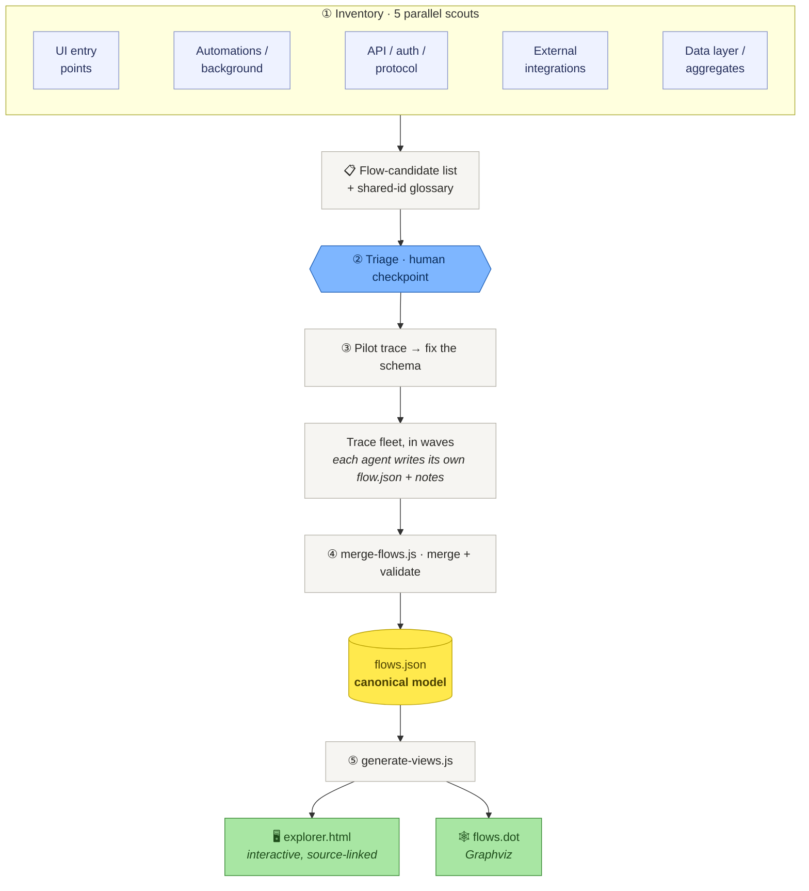

# event-storming-recovery

**Recover a strategic [Event Storming](https://www.eventstorming.com/) model from an existing
codebase, and render it as a navigable, source-linked flow explorer.**

Point this at a system that only has its *tactical* implementation (services, repositories,
controllers — no domain model written down) and it recovers the *strategic* view: for every flow
through the system — a user action, a scheduled job, an inbound API call — the actors, commands,
aggregates, events, policies, read models, and external systems it moves through, from entry point
to data write. Each sticky links to the exact source that implements it, so you can step through
any flow left-to-right and click into the code behind it.

It's a repeatable, orchestrated process: parallel **scout** agents inventory every entry point,
one **deep-trace** agent per flow reads the code end-to-end, and the results merge into a validated
`flows.json` that renders to an interactive `explorer.html` and a Graphviz `flows.dot`.

## See the output in 30 seconds

```sh
node tools/merge-flows.js examples/toy-shop/traces examples/toy-shop/model/flows.json
node tools/generate-views.js examples/toy-shop/model/flows.json examples/toy-shop/model --title "Toy Shop Event Storming"
# then open examples/toy-shop/model/explorer.html in a browser
```


Left: the flows, badged by kind (read/write/policy) and status (dead/superseded), with hotspot
counts. Center: the flow as an Event-Storming sticky lane, invariants hanging off aggregates, edge
verbs between stickies. Click any sticky for its tactical explanation and a `vscode://` deep link to
`file:line`. Red cards are **hotspots** — the questions a human needs to answer.

## Run it on your own codebase

This is an **agent-orchestrated** process (a coding agent — e.g. Claude Code — drives it; the
deterministic parts are the schema, the merge/validate, and the render). Two ways to start:

- **As a skill:** install `skills/event-storming-recovery/` and invoke it; it drives all five phases.
- **By hand / any agent:** follow `prompts/00-orchestrator.md`. It tells the orchestrator how to
  spawn the scouts (`prompts/01-scouts.md`), triage with you (`prompts/02-triage.md`), brief the
  trace agents (`prompts/03-trace-briefing.md`), then merge and render.

Then the deterministic pipeline:

```sh
node tools/merge-flows.js  <tracesDir> <out>/model/flows.json          # merge many trace slices + validate
node tools/generate-views.js <out>/model/flows.json <out>/model \      # emit flows.dot + explorer.html
    --repo-root "/abs/path/to/your/checkout" --title "<Project> Event Storming"
```

## How it works



- **`flows.json`** is the single source of truth; the explorer and DOT are generated from it.
- **Shared node ids** unify recurring concepts across flows (one `agg-order` node, referenced by
  every flow that touches it), so the flows join into one navigable map instead of 30 islands.
- **Reachability checks** during tracing catch **dead and superseded** flows — often where the most
  interesting recovered intent lives (why was this replaced? what does the successor do differently?).

See [`METHOD.md`](METHOD.md) for the full methodology and the reasoning behind each phase.

## Repo layout

| path | what |
|---|---|
| `prompts/` | the orchestrator playbook + scout / triage / trace-briefing templates (the method, encoded) |
| `schema/flows-schema.md` | the node / edge / flow contract every trace conforms to |
| `tools/merge-flows.js` | merge per-flow traces into one `flows.json`, validate structural rules |
| `tools/generate-views.js` | render `flows.json` → `flows.dot` + self-contained `explorer.html` |
| `skills/event-storming-recovery/` | the process packaged as a runnable Claude Code skill |
| `examples/toy-shop/` | a tiny synthetic model so the pipeline runs out of the box |

## Limits (read before trusting it)

A code-derived model is an **always-true scaffold and a conversation starter — not a replacement
for a workshop wall.** It faithfully captures nodes, edges, invariants, and source anchors, but it
does *not* capture: true timeline order (horizontal position is reachability, not chronology),
pivotal events, bounded-context boundaries (those must be *declared* by the team, not inferred from
folders), swimlanes, or the human hotspots a live session surfaces. The tracing agents can be wrong;
every finding names its source so you can check it, and the hotspots are framed as questions, not
verdicts. Use it to get oriented fast and to drive the conversations that need a human.

## Iterating

Everything is regenerable from the per-flow `traces/*.json`. To extend a map, add a new trace
(follow `schema/flows-schema.md`, reuse the shared node ids so it joins the existing flows) and
re-run the two commands. To improve the *method*, edit the prompts in `prompts/` and the schema —
the pilot-trace-then-fix loop in phase 3 is designed to surface schema gaps cheaply.

## License

MIT — see [LICENSE](LICENSE).
